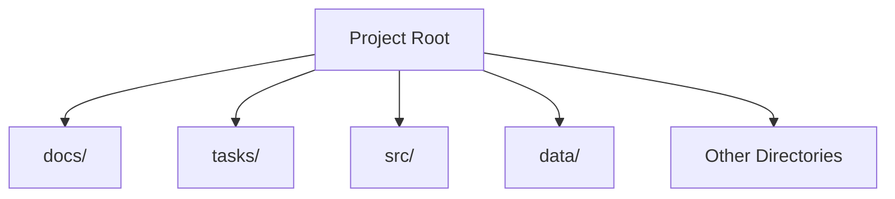

---
描述：项目的顶级目录结构
全局变量：
始终应用：false
---
# 目录结构

```mermaid
flowchart TD
    Root[Project Root]
    Root --> 文档[docs/]
    Root --> 任务[tasks/]
    Root --> 源代码[src/]
    Root --> 数据[data/]
    Root --> 其他[Other Directories]
```