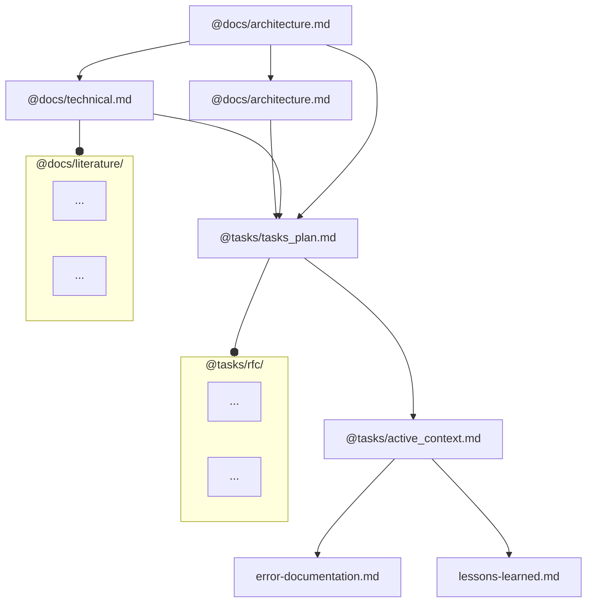
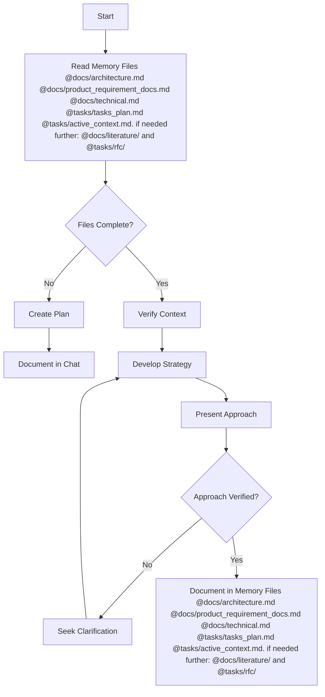
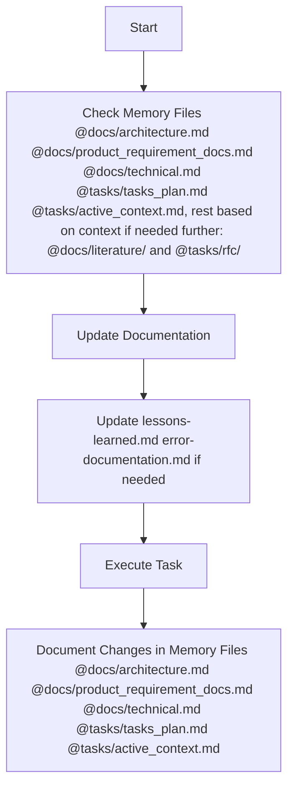
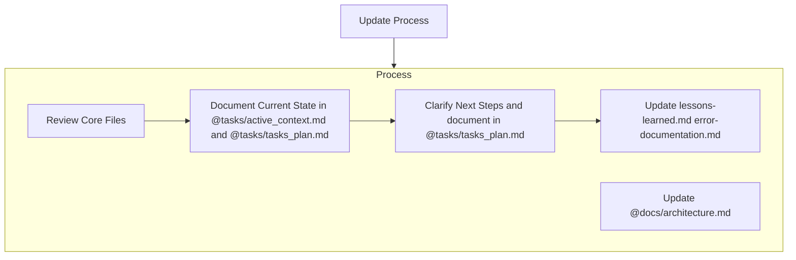
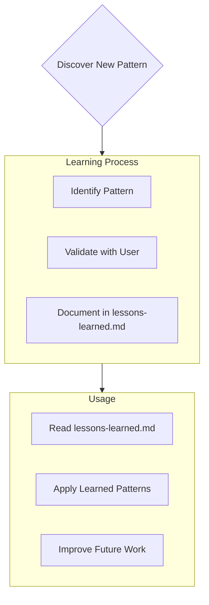

---
描述：始终包含项目上下文。
全局变量：
始终应用：true
---
# 内存文件结构
这概述了管理文档和使用文件系统维护内存的基本原理、所需文件、工作流结构和基本程序。
内存文件由必需的核心文件和可选的上下文文件组成。这些文件以清晰的层次结构相互构建：

## 核心文件（必需）
  7个文件：
  1. [product_requirement_docs.md](../../docs/product_requirement_docs.md): 项目的产品需求文档 (PRD) 或 SOP。
  - 为什么这个项目存在
  - 它解决的问题
  - 定义核心要求和目标
  - 塑造所有其他文件的基础文档
  - 项目范围的真实来源
  - 如果不存在则在项目开始时创建

  2. [architecture.md](../../docs/architecture.md): 系统架构
  - 应该如何运作
  - 组件关系
  - 依赖项
  - 解决方案的工作流程
  - 解决方案概述的美人鱼图：每个组件和代码流程

  3. [technical.md](../../docs/technical.md): 技术规范
  - 使用的技术
  - 开发设置
  - 关键技术决策
  - 使用的设计模式
  - 技术限制

  4. [tasks_plan.md](../../tasks/tasks_plan.md): 详细的任务待办事项
  - 深入的任务列表和项目进度
  - 什么有效
  - 还剩下什么需要建设
  - 当前状态
  - 已知问题
  
  5. [active_context.md](../../tasks/active_context.md): 当前开发状态
  - 目前的工作重点
  - 主动决策和考虑
  - 最近的变化
  - 后续步骤

  6. [error-documentation.md](error-documentation.md): 错误日志
  - 在交互过程中，如果您发现此项目中的错误已修复或您收到的可重复使用的更正，您应该在@error-documentation.md 文件中记下，这样您就不会再犯同样的错误。
  - 已知问题：其状态、背景和解决方案

  7. [lessons-learned.md](lessons-learned.md): 学习日志
  - 它捕捉重要的模式、偏好和项目情报
  - 详细信息请参阅@lessons-learned.md

## 上下文文件（可选）
详细文档。如有上下文需要，可按需检索。

1. docs/literature/ ：
  - 文献调查和研究都在这个目录中  
  - 每个文献主题都是一个乳胶文件（docs/literature/*.tex）

2. 任务/rfc/ ：
  - 包含@tasks_plan.md 中每个单独任务的 RFC
  - RFC 将采用乳胶文件格式 (tasks/*.tex)

## 附加上下文
当它们有助于组织时，在 docs/ 或 tasks/ 中创建其他文件或文件夹作为内存文件：
- 集成规范
- 测试策略
- 基准测试设置
- 可能的扩展
- 部署程序

# 核心工作流程
现在我们定义读取/写入这些内存文件的程序工作流程。
系统以不同的模式运行：（计划/行动）或类似的（架构/代码），完全由用户输入或当前请求中的任务控制。当前输入将决定模式，工作流程的选择始终基于此模式。在用户输入中，也可以通过“模式 = 计划模式”/“架构模式”或“模式 = 行动模式”/“代码模式”指定显式模式设置。因此，如果存在显式模式设置，则遵循该模式；否则，根据请求猜测模式。如果您不是 100% 确定，请询问模式；如有任何疑问，请明确提出。

## PLAN or Architect MODE

## ACT or Code MODE

# Documentation Updates

内存文件更新发生在以下情况：
1. 发现新的项目模式
2. 实施重大变革后
3. 当用户请求**更新内存文件**时（必须审查所有核心文件）
4. 何时需要澄清上下文
5. 计划重要部分核实后

注意：当**更新内存文件**触发时，我必须检查每个核心内存文件，即使有些文件不需要更新。特别关注 [active_context.md](../../tasks/active_context.md) 和 [tasks_plan.md](../../tasks//tasks_plan.md)，因为它们会跟踪当前状态。此外，[architecture.md](../../docs/architecture.md) 包含当前工作流程的一部分，任何代码更新都会更新该部分。

# 学习日志 [lessons-learned.md](lessons-learned.md)

[lessons-learned.md](lessons-learned.md) 文件是我每个项目的学习日志。它记录了重要的模式、偏好和项目情报，帮助我更高效地工作。在与您和项目合作的过程中，我会发现并记录那些仅凭代码难以察觉的关键见解。

## 捕获什么
- 关键实施路径
- 用户偏好和工作流程
- 项目特定的模式
- 已知挑战
- 项目决策的演变
- 工具使用模式

格式灵活，专注于捕捉宝贵的见解，帮助我更有效地与您和项目合作。请将 [lessons-learned.md](lessons-learned.md) 视为一份动态文档，它会随着我们的合作而变得更加智能。