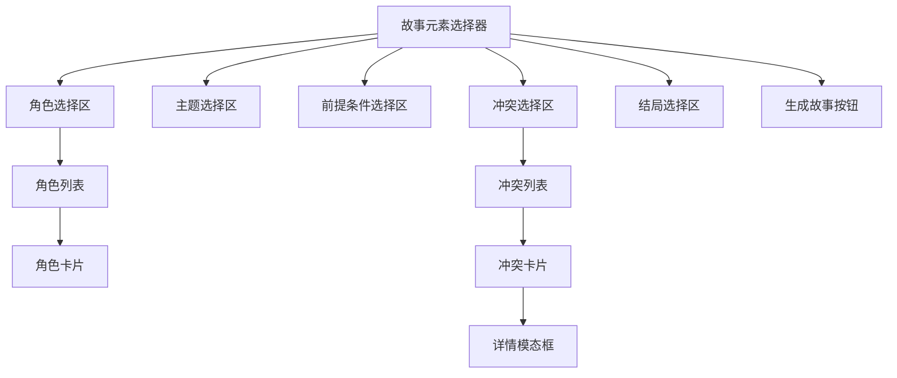

# 系统架构
## 概述
- 项目背景、目标、核心业务
- 项目名称、版本、负责人

## 技术栈

- 框架: nextjs
- 路由: app router
- UI库: shadcnUI
- ORM: prisma
- 缓存: upstash
- 数据库： supabase
- 授权: nextauthjs
- CI/CD: vercel

## 模块划分与职责

### 1. 页面模块 (Pages)

**职责：**

  * **路由入口：** `pages` 目录下的文件直接对应应用的路由。每个文件（或目录）代表一个页面或一组页面。
  * **数据获取：** 在页面组件中，通常会使用 `getStaticProps`、`getServerSideProps` 或 `getInitialProps` 等 Next.js 提供的数据获取方法来为页面预加载数据。
  * **布局集成：** 页面组件会集成应用的整体布局（如头部、尾部、导航等）。
  * **组件编排：** 页面主要负责将各种独立的 UI 组件组合起来，形成一个完整的视图。

**示例结构：**

```
pages/
├── index.js             // 首页
├── about.js             // 关于页面
├── blog/
│   ├── index.js         // 博客列表页
│   └── [slug].js        // 博客详情页 (动态路由)
└── api/
    └── hello.js         // API 路由
```

### 2. 组件模块 (Components)

**职责：**

  * **UI 复用：** 存放可复用的 UI 组件，这些组件不包含业务逻辑，只负责渲染 UI。
  * **状态管理（局部）：** 某些组件可能包含自己的局部状态，但通常不涉及全局状态管理。
  * **样式封装：** 组件的样式应该独立于其他组件，可以通过 CSS Modules, Styled Components, Tailwind CSS 等方式进行封装。

**分类建议：**

  * **通用组件 (Common/UI)：** 按钮、输入框、卡片等在整个应用中普遍使用的基础组件。
  * **业务组件 (Business/Specific)：** 针对特定业务场景的组件，如产品列表项、评论框等。

**示例结构：**

```
components/
├── common/
│   ├── Button.js
│   └── Card.js
├── layouts/             // 布局组件
│   ├── MainLayout.js
│   └── AuthLayout.js
├── product/             // 产品相关组件
│   ├── ProductCard.js
│   └── ProductList.js
└── user/                // 用户相关组件
    └── UserProfile.js
```

### 3. 服务/API 模块 (Services/API)

**职责：**

  * **数据交互：** 封装与后端 API 交互的逻辑，负责数据的发送和接收。
  * **业务逻辑（部分）：** 轻量级的业务逻辑可以在这里处理，例如数据格式化、错误处理等。
  * **第三方服务集成：** 集成外部服务（如认证服务、支付服务）的逻辑。

**示例结构：**

```
services/
├── authService.js       // 认证服务
├── productService.js    // 产品服务
└── api.js               // Axios 实例或通用 API 请求封装
```

### 4. 工具模块 (Utils)

**职责：**

  * **通用函数：** 存放不依赖于任何特定组件或业务逻辑的通用工具函数，如日期格式化、数据验证、字符串处理等。
  * **常量定义：** 存放应用中使用的常量，如 API 地址、错误码等。

**示例结构：**

```
utils/
├── dateUtils.js
├── validationUtils.js
├── constants.js
└── helpers.js
```

### 5. 样式模块 (Styles)

**职责：**

  * **全局样式：** 存放应用的全局样式，如重置样式、字体定义、颜色变量等。
  * **主题变量：** 如果使用主题，可以存放主题相关的变量。
  * **按需加载：** 确保样式能够被 Next.js 正确加载和优化。

**示例结构：**

```
styles/
├── globals.css          // 全局样式
├── variables.css        // CSS 变量
└── theme.js             // 如果使用 CSS-in-JS 库
```

### 6. 钩子模块 (Hooks)

**职责：**

  * **逻辑复用：** 封装可复用的 React Hook，将组件中的状态逻辑抽离出来。
  * **副作用处理：** 处理异步操作、订阅事件等副作用。

**示例结构：**

```
hooks/
├── useAuth.js           // 认证相关的 Hook
├── useDebounce.js
└── useForm.js
```

### 7. Store 模块 (State Management)

**职责：**

  * **全局状态管理：** 如果应用需要全局状态管理（如 Redux, Zustand, Recoil 等），这里存放相关的 action, reducer, store 配置等。
  * **数据流控制：** 负责整个应用的数据流转和状态更新。

**示例结构 (以 Redux 为例):**

```
store/
├── index.js             // store 配置
├── reducers/
│   ├── authReducer.js
│   └── productReducer.js
└── actions/
    ├── authActions.js
    └── productActions.js
```

## 界面设计：故事元素选择器

### 布局


### 组件结构
- **StorySelectorPage**：主页面组件
- **ElementSection**：可复用故事元素区块组件
- **ElementCard**：元素卡片组件
- **DetailModal**：元素详情模态框
- **GenerateButton**：生成故事按钮

### 响应式方案
| 屏幕尺寸 | 布局方案          | 元素排列 |
|----------|-------------------|----------|
| ≥768px   | 网格布局 (3列)    | 角色、主题、前提条件<br>冲突、结局、按钮 |
| <768px   | 垂直堆叠布局      | 所有区块垂直排列 |

### 功能说明
1. 五个独立区块分别展示：
   - 角色 (Characters)
   - 主题 (Subjects)
   - 前提条件 (Predicates)
   - 冲突 (Conflicts)
   - 结局 (Outcomes)
   
2. 交互功能：
   - 卡片选择（多选）
   - 详情查看（点击"详情"按钮）
   - 生成故事（底部按钮提交）

3. 复杂元素处理：
   - 冲突元素提供模态框详情展示
   - 响应式设计适配移动/桌面设备